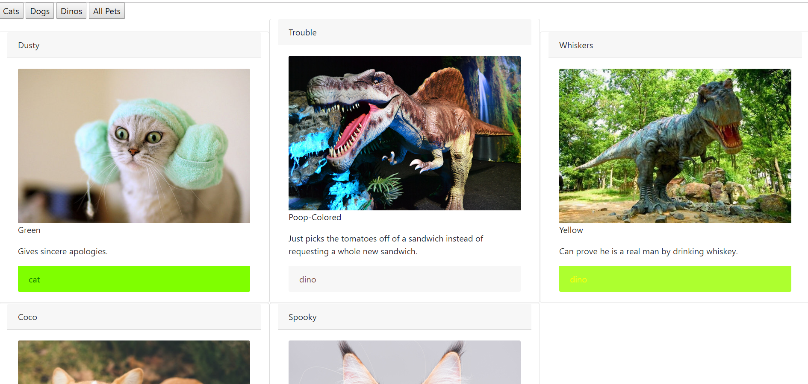

# Adoption site

This site was built as an exercise in using modular javascript design, xhr requests, and json file structure.  It is an adoption site for cats, dogs,and ...dinosaurs.  Animals are displayed in bootstrap styled cards with information from the json file and can be filtered by type.

## Screenshots


## How to run this project
* Use npm to install http-server in your terminal:
```sh
npm install -g http-server
```
* Run the server
```sh
hs -p 9999
```
* Open chrome and navigate to:
```
localhost:9999
```
* Click on an animal species button to filter by species.  Click on the all animals to remove any filter.